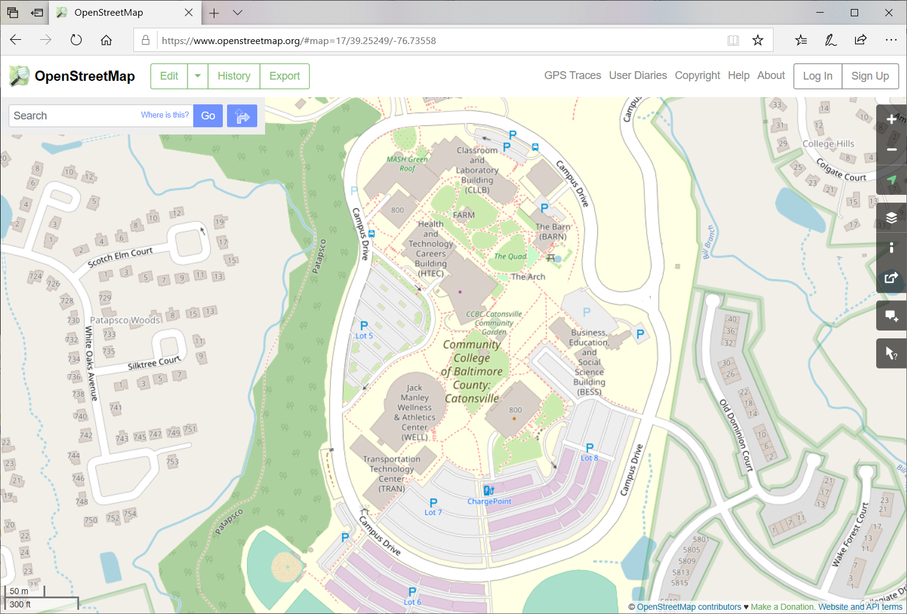

class: center, middle, inverse
# Getting started with OpenStreetMap
MaptimeBmore & CCBC GIS Capstone

March 10, 2020

.footnote[This presesentation was made with [RemarkJS](https://github.com/gnab/remark)]

---
.left-column[
  ## Agenda
]
.right-column[
1. Introduction

1. The intersection of GIS and OSM

1. How to contribute to OSM (adding / editing data)

1. How to download and extract data from OSM

1. Resources
]

---
.left-column[
  ## Introduction
]
.right-column[
  OpenStreetMap is a **global open data portal**:
  - Free for everyone to use .red[*]
  - Anyone can add to it
  - You can download the data for your own project
  - Some say it's kind of like the *Wikipedia* of maps


  .image-middle[]<br>
  .font-small[[OpenStreetMap.org](https://Openstreetmap.org)]<br>
  .font-small[[OSM Welcome Mat: welcome.openstreetmap.org](https://welcome.openstreetmap.org/)]

  .footnote[.red[*] OSM has a license and OpenStreetMap.org does have usage limits, see: [Terms of Use](https://wiki.osmfoundation.org/wiki/Terms_of_Use)]
]

---
.left-column[
  ## Introduction
  ### Explore POIs
]
.right-column[
  --picture of OSM with POIs
]

---
.left-column[
  ## Introduction
  ### View different basemaps
]
.right-column[
  --pictures of OSM with different basemaps
]

---
.left-column[
  ## Introduction
  ### Turn-by-turn navigation
]
.right-column[
  ## Directions for car, bike, foot travel
  -- pictures of routing
]

---
.left-column[
  ## Introduction
  ### Mobile apps
]
.right-column[
  -- pictures of different mobile map alternatives for OSM 
]

---
.left-column[
  ## Introduction
  ### Webmap Basemaps
]
.right-column[
  -- supports a number of Basemaps for your web mapping applications (e.g., Leaflet, OpenLayers)
  -- https://leaflet-extras.github.io/leaflet-providers/preview/
]

---
.left-column[
  ## Introduction
  ### Used by many
]
.right-column[
OpenStreetMap is used by people all over the world: 
  - individuals
  - volunteers
  - companies 
    - Amazon, Apple, Esri, Facebook, Garmin, Mapbox...
  - nonprofits
  - governments
  - organizations
  - and more

There are many ways to use OpenStreetMap: as a basemap, using the OSM data for routing or navigation, using OSM data for GIS analysis, such as planning or logistics for humanitarian groups, utilities, governments and more.

~ https://welcome.openstreetmap.org/about-osm-community/consumers/
]

---
class: center, middle, inverse
# because...

---
class: center
# OpenStreetMap * **is not** just a basemap*
.image-width-max[]

---
.left-column[
  ## Introduction
]
.right-column[
  OpenStreetMap is a global **geodatabase** of<br>
  .underline[everything] and .underline[anything] that people add to the map:
  - roads, crosswalks, speed bumps, stop lights...
  - restuarants, daycares, playgrounds, cannons...
  - forests, central business districts, boundaries...
  - land cover, gravestones, utility ROWs..

.image-middle[]<br>
.font-small[Example of OSM data in the [JOSM editor](https://josm.openstreetmap.de/)]
.footnote[
  JOSM image credit: [Wikmedia Commons](https://commons.wikimedia.org/wiki/File:JOSM_screenshot_hoofdscherm.png)
]

<!--  -->
]


---
.left-column[
  ## Introduction
]
.right-column[
  OpenStreetMap is **GIS** in action at a global scale.

]


---
.left-column[
  ## OSM & GIS
]
.right-column[

  editing in OSM for just a few minutes covers a huge range of what you learn about in a GIS program:
  - Editing, digitizing, image interpretation
  - Databases
  - Metadata and attributes
  - Data Quality (QA/QC)
  - 
]

---
.left-column[
  ## OSM & GIS
  ### Editing & Digitizing
  ### Image Interpretation
]
.right-column[
  editing in OSM for just a few minutes covers a huge range of what you learn about in a GIS program:
  
]

---
.left-column[
  ## OSM & GIS
  ### Databases
]
.right-column[
- OSM data model (nodes, ways, relates)
]

---
.left-column[
  ## OSM & GIS
  ### Metadata
  ### Attributes
]
.right-column[
## Tags
https://wiki.openstreetmap.org/wiki/Tags
### Key:Value pairs
10's of thousands of key tags across OSM
```JS
  key: Highway
  highway: motorway
  highway: trunk
  highway: primary
  highway: secondary
  ...
  highway: unclassified

  key: Leisure
  leisure: bowling_alley
  leisure: escape_game
  leisure: maze
  ...
  ...
```
]
